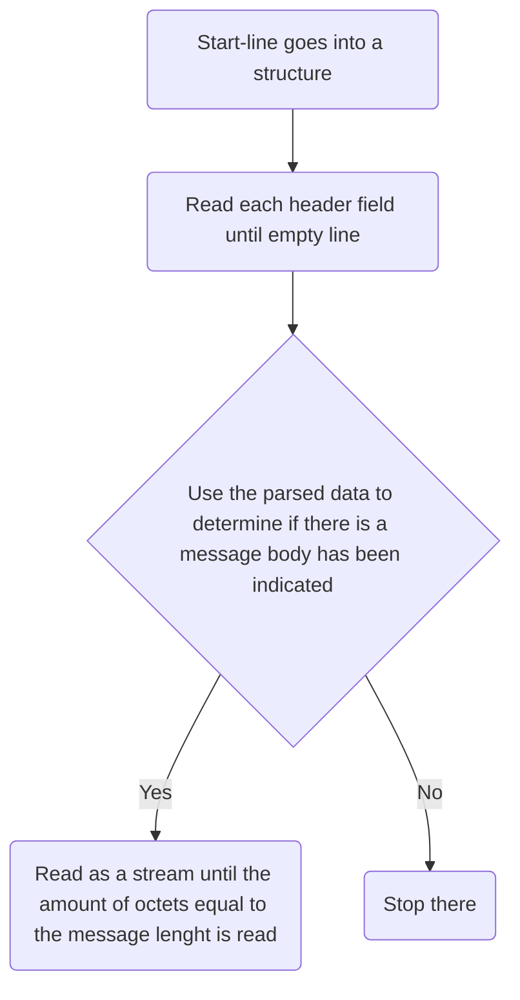

to check if the character is linear whitespace -> got it from [there](https://github.com/facebook/proxygen/blob/main/proxygen/lib/http/HTTPHeaders.h#L32C1-L38C2)
```c++
inline bool isLWS(char c) {
  // Technically \r and \n are only allowed in LWS if they appear together.
  if (c == ' ' || c == '\n' || c == '\t' || c == '\r') {
    return true;
  }
  return false;
}
```

## RFC 9112 Message overview
HEADER = field-line.
This document will give me overview to see semantics for HTTP 1.1
ERROR handling Section 2 -> RFC 9110
List of field name https://www.iana.org/assignments/http-fields/http-fields.xhtml

RFC 9112 section 2.1 Message format this is the format for requests and responses
```
HTTP-message   = start-line CRLF
                 *( field-line CRLF )
                 CRLF
                 [ message-body ]
```
[A single LF can be the line terminator and thus ignoring all the CR that precede the LF ](https://datatracker.ietf.org/doc/html/rfc9112#section-2.2-3)

Although the line terminator for the start-line and fields is the sequence CRLF, a recipient MAY recognize a single LF as a line terminator and ignore any preceding CR.

### Start-line
Where it differ is that start-line can be request-line (request)or status-line (response)
```
 start-line     = request-line / status-line
```

In the start line the HTTP-version is indicated it is **CASE SENSITIVE** section 2.3 HTTP Version
```
HTTP-version  = HTTP-name "/" DIGIT "." DIGIT
HTTP-name     = %s"HTTP"
```
## Section 2.2 Message Parsing RFC 9112
Normal procedure for parsing HTTP message (It doesn't matter whether it's a request or a response).
1. start-line goes into a structure
2. read each header field line into a hash table by field name until the empty line
3. Used the parsed data to determine if a message body has been indicated
4. If a message body has been indicated then it is read as a stream until an amount of octets equal to the message body length is read or the connection is closed.



## Section 3 Request Line RFC 9112
**Request MANDATORY**
- A client MUST send a Host header field. [3.2 RFC 9112](https://datatracker.ietf.org/doc/html/rfc9112#name-request-target)
- The method name are case sentitive [3.2 RFC 9112](https://datatracker.ietf.org/doc/html/rfc9112#name-method)
- Minimum lenght support is 8000 octets of request line. [3. RFC 9112](https://datatracker.ietf.org/doc/html/rfc9112#name-request-line)
- For the request-target no whitespace is allowed.

Here the format of request line SP (Single Space)
```
  request-line   = method SP request-target SP HTTP-version
```

Although the request-line grammar rule requires that each of the component elements be separated by a single SP octet, recipients MAY instead parse on whitespace-delimited word boundaries and, aside from the CRLF terminator, treat any form of whitespace as the SP separator while ignoring preceding or trailing whitespace; such whitespace includes one or more of the following octets: SP, HTAB, VT (%x0B), FF (%x0C), or bare CR. However, lenient parsing can result in request smuggling security vulnerabilities if there are multiple recipients of the message and each has its own unique interpretation of robustness (see [Section 11.2](https://datatracker.ietf.org/doc/html/rfc9112#request.smuggling)).

A server that receives a method longer than any that it implements SHOULD respond with a 501 (Not Implemented) status code.

A server that receives a request-target longer than any URI it wishes to parse MUST respond with a 414 (URI Too Long)

Various ad hoc limitations on request-line length are found in practice. It is RECOMMENDED that all HTTP senders and recipients support, at a minimum, request-line lengths of **8000 octets.**

#### 3.1  Method RFC 9112 
It is case sensitive.
```
method = token
```
Request methods can be found [here](https://datatracker.ietf.org/doc/html/rfc9110#name-methods)

#### 3.2 Request Target
Identifies the target resource upon which to apply the request.
There are 4 format of request-target
```
request-target = origin-form THE MOST COMMON FORM
                 / absolute-form USED WHEN MAKING PROXY request
                 / authority-form ONLY USED FOR CONNECT request
                 / asterisk-form ONLY USED FOR OPTIONS request
```
The most common form is the [origin-form](https://datatracker.ietf.org/doc/html/rfc9112#name-origin-form)

## 4. Status line
It's the line of the response.

```
status-line = HTTP-version SP status-code SP [ reason-phrase ]
```
### Status code
Always 3 digit (ex:200)
```
status-code = 3DIGIT
```
More about the status code [here](https://datatracker.ietf.org/doc/html/rfc9110#name-status-codes)

## 5. Field name
https://datatracker.ietf.org/doc/html/rfc9112#name-field-syntax
```
field-line   = field-name ":" OWS field-value OWS
```
`"(),/:;<=>?@[\]{}` these characters are not allowed in a HTTP field-name. [source it's called token in the doc](https://www.rfc-editor.org/rfc/rfc9110#name-tokens)
## 5.5 Field-value
VCHAR = field-vchar [ 1*( SP / HTAB / field-vchar ) field-vchar ]
Field value in the context of header

## 6.1 Transfer-Encoding
Transfer-encoding and Content-Length are excluding -> https://datatracker.ietf.org/doc/html/rfc9112#name-message-body

RFC 9112 -> https://datatracker.ietf.org/doc/html/rfc9112#name-transfer-codings
RFC 9110 -> https://datatracker.ietf.org/doc/html/rfc9110#name-te
## 6.3 Message Body length (response)
RFC 9112 -> https://datatracker.ietf.org/doc/html/rfc9112#name-message-body-length


## 7.1 Chuncked transfer coding

https://datatracker.ietf.org/doc/html/rfc9112#chunked.encoding