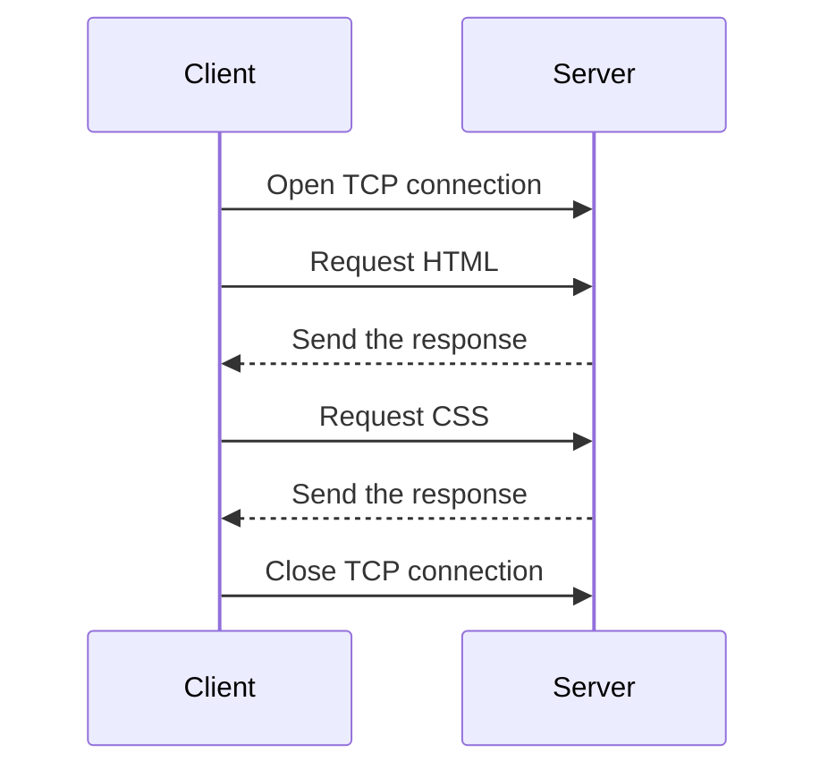

- HTTP Hypertext Transfer Protocol.
- https://http.dev/ 
- https://developer.mozilla.org/en-US/docs/Web/HTTP

- RFC HTTP 1.1 
	- [HTTP 1.1](https://datatracker.ietf.org/doc/html/rfc9112 )
	- [HTTP Semantics](https://datatracker.ietf.org/doc/html/rfc9110)
	- [HTTP Caching](https://datatracker.ietf.org/doc/html/rfc9111)
	- HEADER -> https://en.wikipedia.org/wiki/List_of_HTTP_header_fields
- Site web statique
- HTTP code
- HTTP send files
- HTTP Methods -> https://datatracker.ietf.org/doc/html/rfc2616#section-9
	- GET 
	- POST 
	- DELETE 
- telnet establish connection 
- domain for testing 
	- https://example.re/
	- http://example.com/
## Test
- Telnet
- nginx

## Presentation
HTTP **HyperText Transfer Protocol**
	 Hypertext is text displayed on computer display
Port: 80
Port:443 (HTTPS)

### General principle
The HTTP protocol is  used to requesting and receiving hypemedia ressources like:
- Images
- HTML
- text
- media files
It is a client-server protocol which means requests are initiated by the recipient.
It is an application layer protocol that is sent over TCP ( or TLS encrypted TCP connection)

Example of an HTTP flow.

#### Request
- Message sent by the client.
- Sent by one entity called **the user agent** (A web browser or robot).
- The user-agent is **always** initiating the request, never the server.
Structure of a request
![[http-request.svg]]
#### Responses
- Message sent by the server.
- It appears as only a single machine virtually but it may be a collection of servers sharing the load. 
- With the `host` header they may even share the same IP address.
Structure of a response
![[http-response.svg]]
